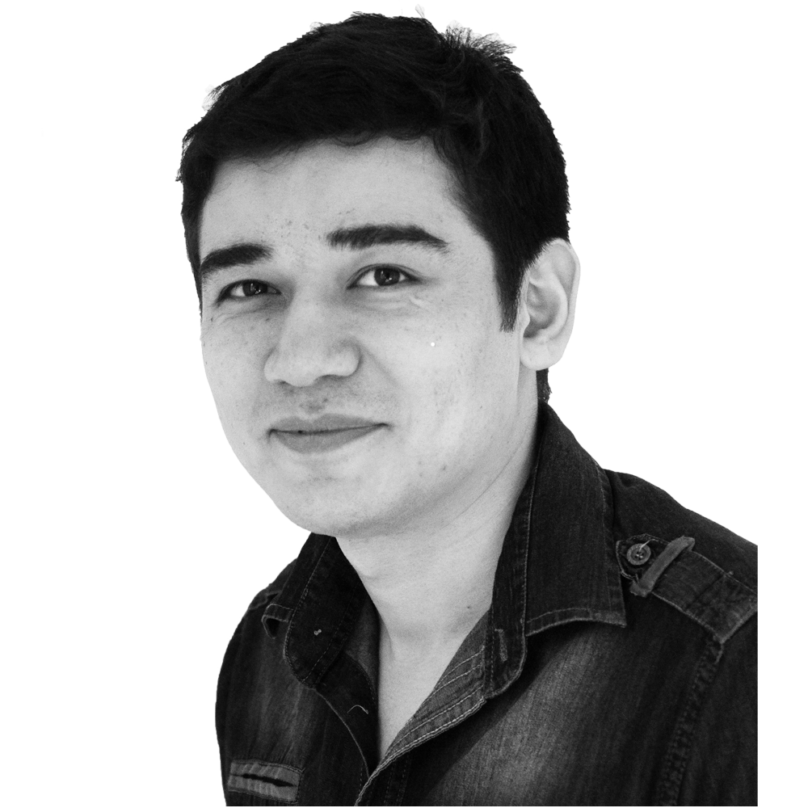

# Izzat Mukhanov

---

Phone: +33 6 66 51 75 71 
E-mail: [izzatbek@gmail.com](mailto:izzatbek@gmail.com) 
Web-site: [izzatbek.github.io](https://izzatbek.github.io) 
Location: Lille, France 
Age: 25 years old

---

### Presentation

I prefer simplicity over complexity and knowledge over ignorance.

---

### Education

* [M.S. in Robotics, Control Engineering, Applied Informatics](http://masteraria.irccyn.ec-nantes.fr/index.php/presentationaria-en)
2012 – 2014 
École Centrale de Nantes

* B.S. in Telecommunications
2007 – 2011 
[Tashkent University of Information Technologies](http://www.tuit.uz/?lang=en)

---

### Work Experience

* **Engineer**, developer (C, C++, Python, Node.js)
2014 - 2016 
Improvement and development of a cross-platform library [libpointing](http://libpointing.org) 
which allows direct access to the USB-HID pointing devices 
and can apply different transfer functions to the raw input. 
Creation of *Java*, *Python*, *Node.js* bindings and distribution with *npm*, *apt*, *brew*, etc. 
Company: [INRIA](http://www.inria.fr/en/) with 
[Nicolas Roussel](http://interaction.lille.inria.fr/~roussel/)
and
[Géry Casiez](http://cristal.univ-lille.fr/~casiez/)

* **Master's Project** (C++, Python, Matlab)
2014 (6 months) 
Implementation of Pedestrian Detection and Tracking system
[[thesis]](https://dl.dropboxusercontent.com/u/61610962/thesis.pdf)
[[video]](https://www.youtube.com/watch?v=o-HAwKvbs8c) 
using Computer Vision and Machine Learning algorithms 
Laboratory: [IRCCyN](http://www.irccyn.ec-nantes.fr/en/) with 
[Philippe Martinet](http://www.irccyn.ec-nantes.fr/~martinet/home.html)

* **Intern** (Python)
2013 (4 months) 
Development of [OpenSymoro+](https://github.com/symoro/symoro) (SYmbolic MOdeling of RObots), 
including 3D visualization and UI using *PyOpenGL* and *wxPython* 
Laboratory: [IRCCyN](http://www.irccyn.ec-nantes.fr/en/) with 
[Wisama Khalil](https://scholar.google.fr/citations?user=cgizGIoAAAAJ&hl=en)

* **Software engineer** (Objective-C)
2011 - 2012 (8 months) 
Development of client-server applications for iOS and Cocos2D games 
Company: [SSD](http://www.ssdsoftwaresolutions.com)

* **Intern**, software developer (C/C++)
2010 - 2011 (10 months) 
Low-level API development for Blu-ray disks processing 
Implementation of the logging system for the project 
Company: ProDVD

* **Intern**, software developer and instructor (C#.NET)
2009 - 2010 (13 months) 
Application development for book catalogization of the city libraries 
Database management (Microsoft SQL) 
Company: [BePro](http://bepro.uz/en/)

<!--      -->

---

### Professional Skills

* Knowledgeable:
	* **C, C++, Python**
	* Cross-platform development, documentation
	* Building, and packaging (OS X, Linux, Windows)
	* Git, Mercurial, SVN
	* Design Patterns, Test Driven Development
	* Continuous Integration, Deployment (Travis, Jenkins, Appveyor)
	* Matlab
	* JavaScript, Node.js, npm, Three.js, jQuery
	* HTML, CSS, Bootstrap, Markdown, Latex
	* Multi-threaded, real-time applications
* Familiar:
	* Objective-C, Pharo, C#.NET, PHP, SQL
	* OpenGL, OpenCV
	* ROS (Robot Operating System)
	* Programming in Val/V+ for industrial robots
* Theoretical background:
	* Computer Vision, Machine Learning, Artificial Intelligence
	* Robot Programming, Modeling and Control
	* Algorithms and Data Structures
	* Math, Optimization, Simulation

---

### Publications

* **[OpenSYMORO : An open-source software package for Symbolic Modelling of Robots](https://hal.archives-ouvertes.fr/hal-01025919)**  
2014 IEEE/ASME International Conference on Advanced Intelligent Mechatronics (355)

---

### Miscellaneous

* Highly adaptable in quickly changing technical environments with very strong organizational
and analytical skills
* Excellent interpersonal and communications skills
* Life-long learning oriented
* Driver’s license

---

### Languages

* English - fluent
* French - fluent
* Russian - native
* Uzbek - native

---

### Hobbies

* Following online courses (MOOCs)
* Foreign languages
* Gym and cycling
* Reading
